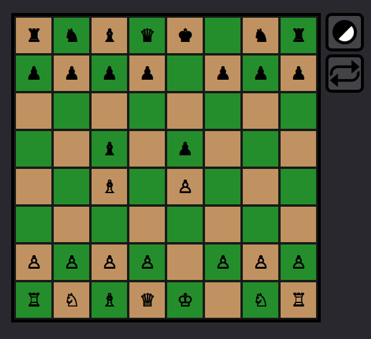

# Javascript Chess
 This is a simple web game made with javascript where you can play chess.  
 It has all the rules programmed into it, including the castling and enpassant rules, with very few exceptions.  
 It <b>currently</b> has no AI to play against or any way to play over a network, serving as a simple offline chess game to play with friends or by yourself.  
 
